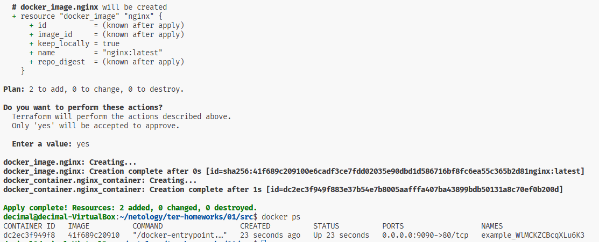

## Домашнее задание к занятию «Введение в Terraform»

**Версия terraform**  


**Задание 1**  
personal.auto.tfvars - тут хранить секреты
"result": "WlMCKZCBcqXLu6K3"

Ошибки:
- Неправильное имя ресурса random_password:  
Неправильно: random_password.random_string_FAKE.resulT  
Правильно: random_password.random_string.result  
имена для ресурсов docker_image нету, надо: resource "docker_image" "nginx"  

Исправленный код:  

resource "docker_image" "nginx" {
  name         = "nginx:latest"
  keep_locally = true
}

resource "docker_container" "nginx_container" {
  image = docker_image.nginx.image_id
  name  = "example_${random_password.random_string.result}"

  ports {
    internal = 80
    external = 9090
  }
}
 **docker ps:**
  

Ключ -auto-approve это авто подтверждение выполнение плана без запроса, если план c  ошибками или есть нежелательные изменения, они будут применены и отменить будет нельзя. Можно потерять данные, инфраструктуру и можно увольняться. Можно лишнего насоздавать, платить за тарификацию потом. Прменение: нашел такое - Быстрое создание/удаление тестовых сред, интеграционные тесты, обучение.

**docker ps hello-world**  
  

Ну а образ не удалился из-за keep_locally = true, было ясно без доков.

**terraform destroy. файл State:**  
{
  "version": 4,
  "terraform_version": "1.12.2",
  "serial": 13,
  "lineage": "ef3f7d38-4abe-e3bc-e520-458554448764",
  "outputs": {},
  "resources": [],
  "check_results": null
}

## Задание 2*  

```hcl
terraform {
  required_providers {
    yandex = {
      source = "yandex-cloud/yandex"
    }
    docker = {
      source  = "kreuzwerker/docker"
      version = "~> 3.0"
    }
  }
  required_version = ">= 0.13"
}

provider "yandex" {
  token     = var.yc_token
  cloud_id  = var.yc_cloud_id
  folder_id = var.yc_folder_id
  zone      = "ru-central1-a"
}

provider "docker" {
  host = "ssh://decimal@${var.vm_public_ip}:22"
}

resource "random_password" "mysql_root_password" {
  length           = 16
  special          = true
  override_special = "_%@"
}

resource "random_password" "mysql_user_password" {
  length           = 16
  special          = true
  override_special = "_%@"
}

resource "docker_container" "mysql" {
  name  = "mysql-${random_password.mysql_root_password.result}"
  image = "mysql:8"

  env = [
    "MYSQL_ROOT_PASSWORD=${random_password.mysql_root_password.result}",
    "MYSQL_DATABASE=wordpress",
    "MYSQL_USER=wordpress",
    "MYSQL_PASSWORD=${random_password.mysql_user_password.result}",
    "MYSQL_ROOT_HOST=%"
  ]

  ports {
    internal = 3306
    external = 3306
    ip       = "127.0.0.1" 
  }

  restart = "unless-stopped"
}

#variables
variable "yc_token" {
  type = string
  sensitive = true
}

variable "yc_folder_id" {
  type = string
}

variable "yc_cloud_id" {
  type = string
}

variable "vm_public_ip" {
  type = string
}

```

## Задание 3*  
